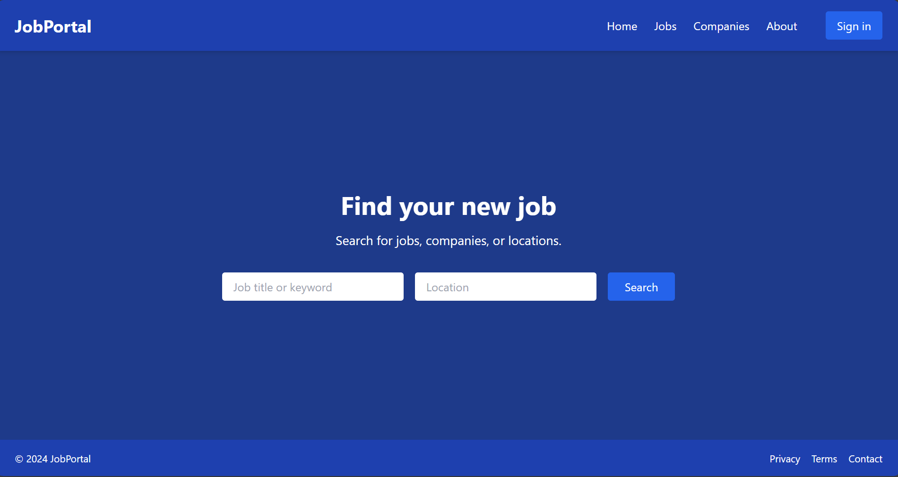

# Job Portal Frontend

This is the frontend of a **Job Portal** web application built using **React.js** and **Tailwind CSS**. It allows users to log in and explore the platform with a responsive and clean UI.

---

## Screenshot



---

## Tech Stack

- **React.js**  
- **Tailwind CSS**  
- **React Router DOM**

---

##  Features Implemented

- Login Page with authentication UI  
- Home Page design  
- Routing between pages  
- Responsive UI using Tailwind

---

## Features Coming Soon

- Registration Page  
- Job Posting Form  
- Job Listings and Filters  
- Role-based Access (Recruiter/User)  
- Backend Integration with Spring Boot

---

## Getting Started

### 1. Clone the Repository

```bash
git clone https://github.com/your-username/job-portal-frontend.git
cd job-portal-frontend

